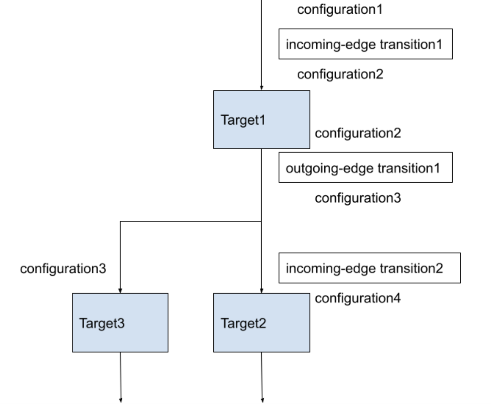
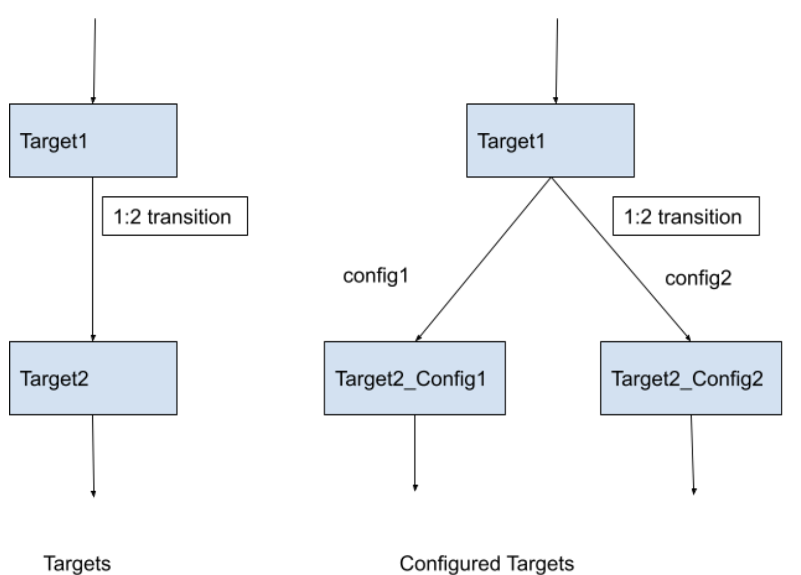
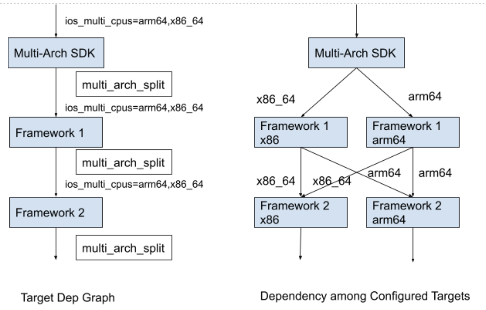
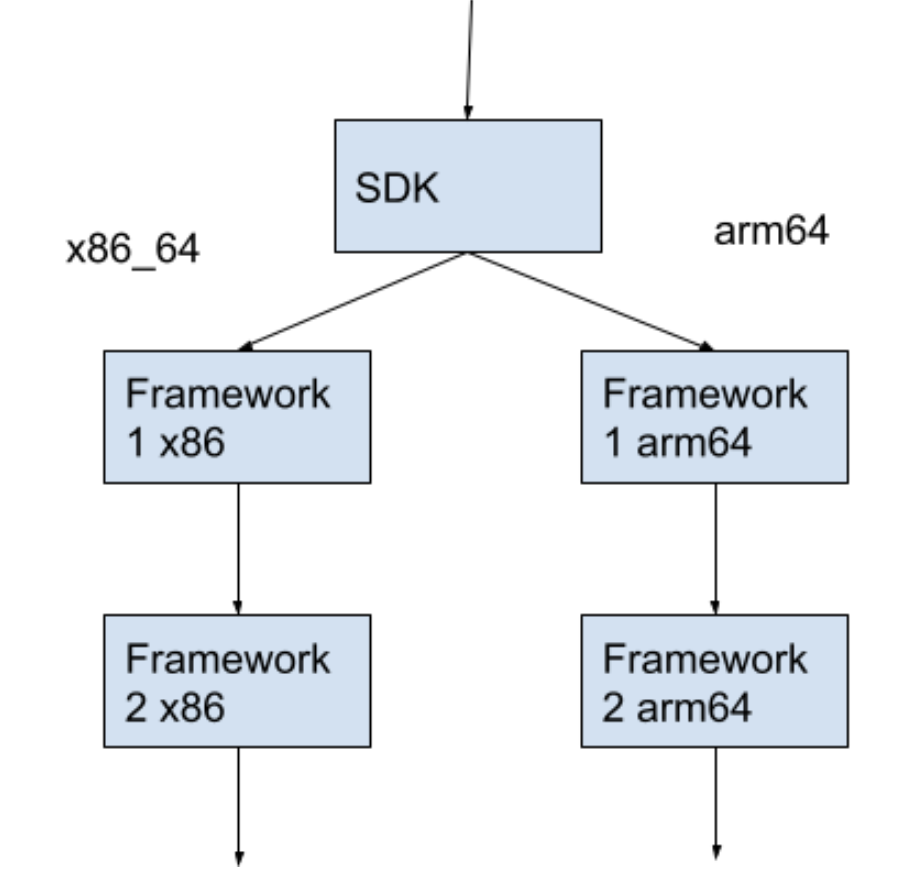
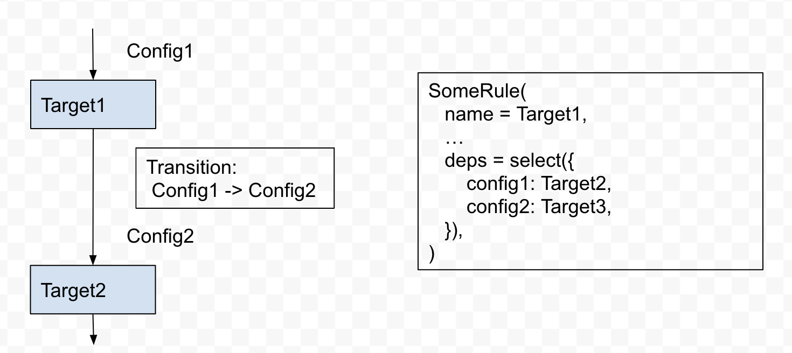

# Transitions and Multiple Architecture Support

## Transition Overview

When building a target, we need to specify build settings that determine how the target is built. Usually all targets of the build graph will use the same set of build settings. However, there are some use cases in which targets need different build settings. For example, we may want to build an xcframework with both arm64 and x86_64 slices, which can be achieved by 1) building the framework for arm64, 2) building the framework for x86_64, and 3) merging them. These three steps correspond to targets with different build settings.

The [bazel doc](https://docs.bazel.build/versions/main/skylark/config.html#user-defined-transitions) gives a basic introduction of transitions. We found that the explanation is not very clear. In addition, there isn’t much discussion about Bazel transition online. Therefore, we summarize our learnings and findings gained from my work in supporting multiple architecture in the AppleFrameworkPackaging rule.

## Terms

- Configuration: The set of build settings used to build a target.
- Configured Target: A target built with a specific configuration. A target may return different outputs when built with different configurations.

## Incoming Edge Transition and Outgoing Edge Transition

Figure 1. Bazel build graph with transitions. The arrows represent the dependency, i.e., Target1 depends on Target2 and Target3.

A target can change the configuration in two ways, i.e., incoming edge transition and outgoing edge transition. The incoming edge transition changes the configuration that the target is built with, while the outgoing edge transition changes the configuration that its deps are built with. If a target doesn’t have incoming edge transition, it will use the configuration that the upstream target passes to it. Figure 1 shows how transitions change the configurations among targets.

## 1:K Transitions

There are two types of transitions, 1:1 transition and 1:k transition. The former transforms a configuration into another one, while the latter transforms a configuration into multiple configurations. The incoming-edge transition must be 1:1 transition, while the outgoing-edge transition can be either one. The 1:k transition essentially maps a target into multiple configured targets at build time, as shown in Figure 2.

Note that K can change based on the input configuration. For example, when building a AppleFrameworkPackaging target with ios_multi_cpus=x86_64, each target will only have one configured target.

Figure 2. The dependency graph of configured targets with 1:k transition

A target with a 1:k outgoing-edge transition can access all configured deps in ctx.attr.deps. Meanwhile, ctx.split_attr.deps is a dictionary from the configurations to the configured targets. For example, The AppleFrameworkPackaging rule attaches the 1:k transition apple_common.multi_arch_split to its deps. When building a AppleFrameworkPackaging target with --ios_multi_cpus=x86_64,arm64, ctx.split_attr.deps returns something like {ios_x86_64: target2_x86, ios_arm64: target2_arm64}, where target2_x86 is built for x86_64 arch and target2_arm64 is built for the arm64 arch. Meanwhile, ctx.attr.deps will return [target2_x86, target2_arm64].

### Performance Issues with 1:K Transition

We need to be careful about the performance impact of 1:k transitions. At build time, each configured target will run all actions of the target. When attaching a 1:K transition to deps, there will be K * count(deps) configured targets, increasing the build time.

Note that it's easy to verify the behavior. If you print a message from Target2 of Figure 2, you will see that the message is printed 2 times. Similarly, you can run “bazel aquery --ios_multi_cpus=arm64,x86_64 'deps(//some/target)’” and see some actions are run multiple times with different configurations.

## Identifies the Configuration of a Target

To correctly build a target with different configurations, we need to identify the configuration in the rule implementation. There are two types of configurations, skylark build settings and native build settings. We can add skylark build settings as an attribute of a rule and read its value in the rule implementation (please see the doc for details).

We cannot directly read native build settings. However, we can get the current native configuration information from ctx.fragments. For example, we can get the current apple platform type from ctx.fragments.apple.single_arch_platform.platform_type (e.g., ios) and the cpu type from ctx.fragments.apple.single_arch_cpu (e.g., arm64). We can use the information to determine which ios arch the target is currently building.

Note that in rules_ios and rules_apple we only transform native build settings. Everything happens in the background so that we can easily forget the configurations.

## Supporting Multi-Architecture SDK with Transitions

The general idea is that we can use 1:k transitions to build frameworks for different arches. Then the root target can assemble them into a single xcframework.

Figure 3. Building Multi-Arch SDK with Transitions

The problem is that there are multiple layers of 1:k transitions in the target dependency graph. The root SDK target depends on a framework, which depends on other frameworks. All of these targets apply the apple_common.multi_arch_split transition to the deps attr, as shown in Figure 3. Then we get a complicated dependency graph of configured targets. This is really hard to handle because the graph grows exponentially.

We observe that each configured framework target only needs the configured targets for its own arch to generate a binary. A configured target for x86_64 doesn't need to access the output of a configured target for arm64. Thus, we simplify the dependency graph as shown in Figure 4.

Figure 4: Updated Dependency Graph of Configured Targets

In the implementation of the apple_framework_packaging rule, we check the current configuration and only use its corresponding slice of ctx.split_attr in packaging the framework. Please take a look at framework.bzl for details. 

## Outgoing Edge transition and select method

select() is a helper method to make a rule attributable configurable. It might be confusing which configuration will be selected when an outgoing-edge transition is assigned to that attribute. It turns out that the target’s current configuration determines the selected configuration of its attributes. The outgoing-edge transition doesn’t affect the select method. Figure 5 shows an example on how transition works with the select method. 

Figure 5: The outgoing-edge transition doesn’t affect the select method
